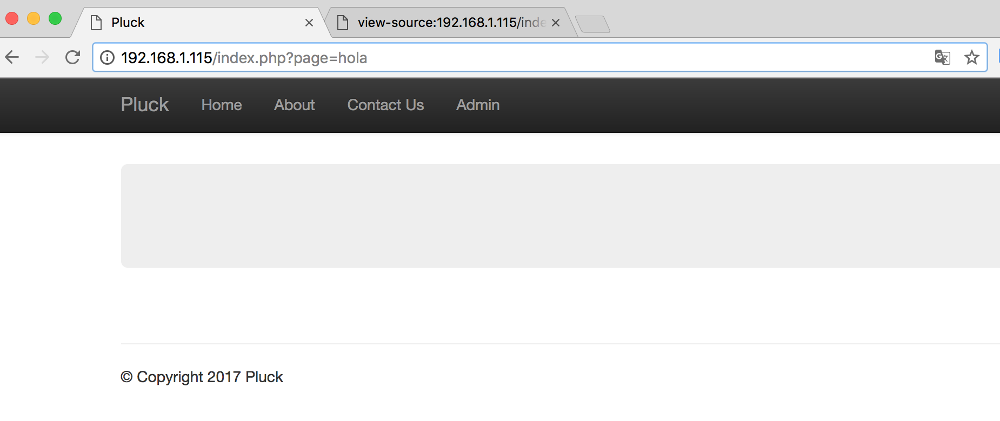

# VULNHUB.PLUCK
Writeup of Vulnhub machine Pluck by k4nj1d.
#VULNHUB.PLUCK

* Descubrimento de la dirección IP de la máquina. Para realizar este asunto hay que lanzar un "script" de Nmap que permita hacer el descubrimiento de los host que se encuentra en la LAN.

    ```
    nmap -sP 192.168.0.1/24
    ````
* Despues de descubrime todos los equipos que tengo en la LAN me quedo con una IP que no conozco y que es **192.168.1.115**

* Empezamos a trabajar esta ip y lanzamos nmap con toda su "fire and fury":
    ```
    PORT     STATE SERVICE VERSION
    22/tcp   open  ssh     (protocol 2.0)
    80/tcp   open  http    Apache httpd 2.4.18 ((Ubuntu))
    3306/tcp open  mysql   MySQL (unauthorized)
    ```
* Tenemos tres servicios que cualquiera de ellos puede ser vulnerable:
    * Un servicio SSH.
    * Un servidor web en el puerto 80.
    * Un servicio de mysql en el puerto 3306.

* Respecto al servicio SSH podemos hacer averiguaciones con Nmap para obtener alguna información de interés. Vamos a lanzar Nmap de manera un poco ruidosa pero eso nos da igual:

    ```
    nmap -f -sS -sV --script auth 192.168.1.115
    ```
    ```
    PORT     STATE SERVICE VERSION
    22/tcp   open  ssh     (protocol 2.0)
    80/tcp   open  http    Apache httpd 2.4.18 ((Ubuntu))
    | http-domino-enum-passwords:
    |_  ERROR: No valid credentials were found (see domino-enum-passwords.username and domino-enum-passwords.password)
    3306/tcp open  mysql   MySQL (unauthorized)
    |_mysql-empty-password: Host '192.168.1.37' is not allowed to connect to this MySQL server
    ```
* Visto lo visto el servicio de mysql no nos va a servir de mucho, entre otras cosas porque no tenemos la versión y sería dar palos de ciego.

* Vamos a explorar que nos está sirviendo en el puerto 80 el servidor web. Pues nos encontramos con que en este servidor corre un Content Management System llamado Pluck. Es muy sencillito y no tiene grandes complicaciones.

* Vemos que "page" está apuntando a un directorio y que este nos puede devolver algo. Probamos a pasarle un parametro y no devuelve nada, eso es que no encuentra lo que busca pero si está haciendo algo.



* Vamonos con "Burp" a ver que pasa. Efectivamente Pluck tiene un **Local File Inclusion** (LFI) [^1]

[^1]:https://www.welivesecurity.com/la-es/2015/01/12/como-funciona-vulnerabilidad-local-file-inclusion/


* Sabiendo todo lo anterior (LFI) vamos a buscar el archivo que más puede comprometer un sistema Linux **_/etc/passwd_**:


* Observamos el documento completo y vemos que lo único interesante es la última línea. En ella hay un script que permite realizar backups. Vamos a ver que nos dice **Burp**.


* Aquí nos da una pista, y nos invita a que utilicemos **tftp**.

    ```
    tftp> get backup.tar
    ```
* Descargado el archivo lo descomprimimos y miramos en todos los dos directorios que aparecen:

    * /home
      * /bob
      * /paul
        * /keys
      * /peter
    * /var

* Después de revisar todos y cada uno de los archivos contenidos en estos directorios, el contenido más interesante está en el directorio **/keys**, que alberga unas claves públicas y privadas muy interesantes que podremos usar para conectarnos al servicio SSH que tenemos corriendo en nuestra máquina.

* Nos quitamos de en medio las claves publicas y nos quedamos con las privadas. Estas claves privadas son con las que vamos a poder realizar el acceso al sistema por SSH.

    ```
    ssh -i id_key4 paul@192.168.1.115
    ```


* Como vemos hay un menú que podemos aprovechar. Del menú lo más interesante es el Listado de directorios, el cambio de directorios y lo principal que es la edición de archivos ¿por qué? ahora lo veremos.

* Editamos cualquier archivo y vemos que nos lanza la edición de dicho archivo con Vi. Esto es genial porque podemos lanzar cualquier tipo de consola desde Vi. 

    ```
    ~
    ~
    ~
    :!/bin/bash
    ```
* Pero no todo es tan magnífico porque vemos que la sesion de la terminal se lanza pero no llega a abrirse totalmente y por lo tanto no se nos muestra.

* Para conseguir que los argumentos se ejecuten por separado vamos al pequeño menú que nos dan con el user paul en ssh y seleccionamos la opción "edit file". Añadimos lo siguiente:

    ```
    ;/bin/bash
    ```
    Ahora veremos como nos lanza nuevamente Vi sin nada. Una vez aquí lo que tenemos que hacer es salir del editor mediante ":!q" y veremos como automáticamente nos devolvera una consola con el user "paul".

* Ahora tenemos que elevar privilegios para poder ser root. Para ello buscaremos archivos del sistema que tengan el bit SUID a establecido, para ello realizamos la siguiente busqueda:

    ```
    find / -perm -4000 -o -perm -2000 2>/dev/null
    ```
    De todos los fichoeros obtenidos el más interesante sin duda es:
    ```
    /usr/exim/bin/exim-4.84-7
    ```
    En este punto tenemos que buscar un exploit que ejecutado en local nos permita elevar privilegios, para ello empleamos la herramienta **searchploit** en Kali que nos ayudará en esta tarea:
    
    ```
    cd /usr/bin
    searchploit exim 4.84
    ---------------------------------------------------------
    |Privilege escalation          |   linux/local/39535.sh |
    ---------------------------------------------------------
    ```
    * Pues ya tenemos nuestro exploit para escalar privilegios:

    

    * Al lanzarlo obtenemos rápidamente una consola de root

    

    * Por último ya solo nos queda buscar el archivo flag en la carpeta /root:

    

    * A modo de conclusión decir que es una máquina muy entretenida que tiene mucha documentación y que permite aprender mucho sobre LFI, ejecución de consolas mediante Vi y elevación de privilegios.

Happy Hacking!
K4nj1d
